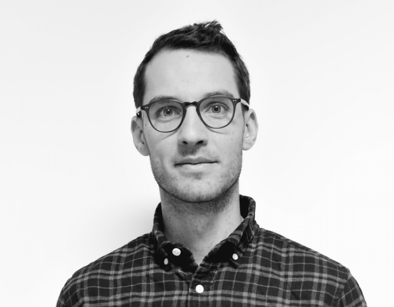
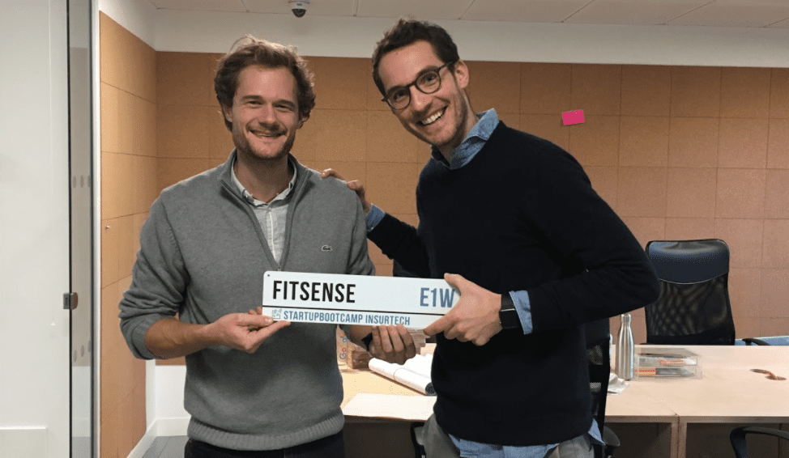
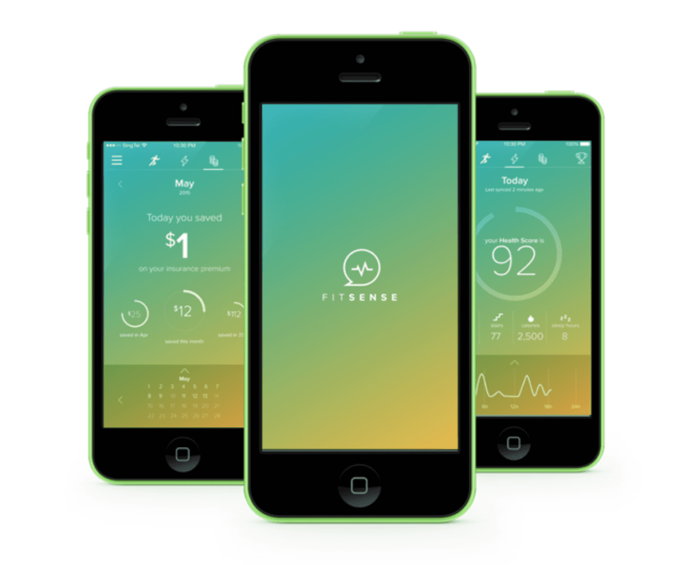
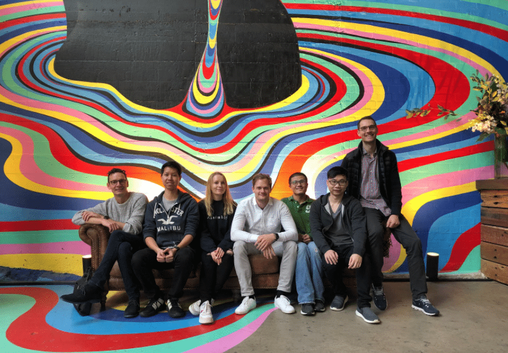

As startup founders, much of our decision making is grounded in empirical data, and that makes sense. There’s too much at stake to risk it all purely on guesswork.

But we also know that our instincts can guide us to places that are bigger and better than if we rely on data alone.

We see [iconic entrepreneurs use their intuition to succeed](https://www.inc.com/marla-tabaka/iconic-entrepreneurs-use-their-intuition-to-succeed-what-you-need-to-know-about-following-your-gut.html) every day - Elon Musk, Bill Gates, Oprah Winfrey.

But knowing when to trust your gut is, I believe, something every entrepreneur struggles with from time to time.

If this is you, I think you’re going to like my conversation with [Jan-Philipp Kruip](https://www.linkedin.com/in/janphilippkruip/).

He is the founder of FitSense, a B2B health and fitness fintech startup that is being used by some of the biggest multinational insurance companies in the world.

In our conversation, he explained how some of his biggest wins came from trusting his gut.

He also shared valuable insights and tips on some of the most important elements of a startup:

- Product
- Marketing
- Hiring
- Raising capital

## Jan-Philipp and His Startup FitSense

#### Q: Did you always want to be an entrepreneur?

**A:** I never saw myself as very entrepreneurial. I always saw myself as a very analytical person. For me it was, more than anything, a culture change.

I went into banking, I didn’t like the culture. So, I moved to consulting, I didn’t like the culture. I worked for a trading company, I didn’t like the culture.

Everything that was supposed to make me happy in the corporate world wasn’t.

I was keen to create something that I could shape. I had an environment in mind, that was very different from what I’d experienced, that I thought could produce better work.

That’s what drew me to entrepreneurship and startups. I was essentially looking for anything that wasn’t what I was doing in the corporate world.

Then I met my co-founder.

I was in Singapore and there was this platform that was essentially Tinder for co-founders.

It was designed to match tech and non-technical founders. I remember there were 70 profiles and I hated 69 of them. Then I saw his profile and I thought “He seems reasonably interesting.”

So we met for a coffee, it was a three-hour meeting. I instantly knew I could trust the guy.

He’d already developed the technology to build an MVP. But he needed help to commercialise it.

I felt I had the right skill set to do that, so I gave myself two years to see if we could make it work.

Only later did I realise that it was this process that makes me entrepreneurial. It definitely wasn’t something I always had in mind early on.

Related: [Expert Interview: The 3 Pillars to Become a Successful Entrepreneur](https://altar.io/expert-interview-become-a-successful-entrepreneur/)

#### Q: What was the moment you decided to co-found FitSense and take the leap into the startup world?

**A:** I made the decision very quickly.

I didn’t have too much to go on but I looked at the situation and thought: Ok he’s got a completely different skill set to me, we have an element of trust between us. He’d developed a technology in a space that I thought was growing.

That was enough for me, it was very much an “I don’t have children, I don’t have a mortgage, I’ve got a bit of savings so what could possibly go wrong?” intuition driven decision.

#### Q: What was your vision for FitSense in the beginning? Has it evolved or changed since then?

**A:** FitSense was initially a data platform that was used in medical research.

Everyone knows it’s healthy to be physically active, but it’s very difficult to put a number on just how healthy. In the past, researchers tried by using questionnaires.

Then in 2013/14, we started seeing all these wearables come onto the market. So researchers started looking for a way to leverage them to gather more accurate data.

FitSense was the platform that collected data from all these different devices. It then created a normalised score. On the back of that, the researchers then did their studies.

So we knew then that people with a better score had better health outcomes.

Then, on the other side of the coin, we noticed the users of the wearables were getting bored after 6 weeks. They had gathered all this data but didn’t know what to do with it.

So we thought, how can we reward them for gathering all this data – for staying active? Can we use the health score we generated to give a monetary reward to our users?

Insurance companies were already doing this for discounts on car insurance premiums based on good driving scores.

We hadn’t worked with insurance before, we were two guys and a dog knocking on the doors of multi-national insurance companies.

Sure, they didn’t mind entertaining us for a coffee meeting, but we didn’t get much further. It took us some time to build up enough credibility to get through the door.

That was about four and a half years ago.

Now we’re in six countries, we’re working with large insurance companies and we’ve gained quite a user base.

Has the vision changed a lot? I wouldn’t say that, but it is broader. Now it’s the insurance companies who use our platform to engage with customers on the topic of health.

By making our platform available for free they gain daily users who start to engage, read the content and check physical activity. You can book a DNA test, you can take a free diabetes test on the app, etc.

So it drives a lot of engagement and that’s really what the product morphed in to. Two years ago we partly exited the business. Now we’re part of the Zurich group – they’re our main partner. However, we also have external customers.

##### Do you have a brilliant startup idea that you want to bring to life?

From the product and business reasoning to streamlining your MVP to the most important features, our team of product experts and ex-startup founders can help you bring your vision to life.

Let's Talk

#### Q: What did you do to validate the idea for your startup MVP?

**A:** Honestly I think we did it a little bit wrong.

We had a B2B2C venture. So we’re selling to insurers so they can distribute it to their customers. But really the proof we needed was from the end customers.

In hindsight, we should’ve gone directly to consumers to prove the product. Then we could’ve taken that proof to the insurers.

We didn’t do that. We were too fixated on the B2B2C distribution model.

So, instead, we tried to convince the insurers to test collaborate with us and test it with _their_ customers. That is a very slow way of validating your product.

Something else that was a mistake, a very typical one, is we just constantly built sh\*t. “I’ve got an idea, let’s build it!” And building features is so time-consuming – there’s so much you can test before you do it.

We had our fair share of the basic mistakes that you can stumble across throughout product development. All of these things look so easy when you look back. But back then it wasn’t so simple.

#### Q: Who were the main stakeholders for your MVP?

**A:** It’s an interesting question for me because we had two very different stakeholders to please. We had the insurer and the end-customer, both of whom have very different needs.

I think one of the biggest challenges for a  fintech startup is the high barriers of entry. You have a small team, and very limited funding but the requirements in terms of your compliance processes and security standards are very high. And that is before you even know if your product is any good.

While we had a product that was a good MVP for an end customer, pushing it out as a financial service was very slow due to those barriers.

I think we completely underestimated what a fintech MVP would mean in terms of being enterprise-ready. If we’d known that we would’ve taken a very different route.

#### Q: What was the focus of your MVP?

**A:** \[Laughs\] It was a beautiful app, it had exactly three screens. You could log in and you could connect it to your Fitbit. Then there was a screen with a circle and if you filled the circle you’d get a dollar. So basically you could get a dollar a day by being active.

We were a fintech startup who basically rocked up to the insurers and said: “We know if people fill the circle every day they should have 16% less mortality risk. That’s worth X dollars. You as the insurer pay all out users $1 a day to fill it.”

It was very naive but at the time it seemed like a very reasonable request from our side.

So the challenge for us was to monetise the user for data they’re sharing with the insurers.

Related: [From Being Fired to Building a Multi-Million Dollar Fintech Startup](https://altar.io/from-being-fired-to-building-a-multi-million-dollar-fintech-startup/)

#### Q: Did you focus on a particular segment when it came to users?

**A:** From the beginning, we wanted to focus on people who already had a wearable device. It was trying to help people get more out of their existing device.

What we quite quickly realised was our power users were the 40-50-year-olds. They loved the sh\*t out of it. They were the most competitive on the leaderboards, they went all out.

We have a slightly older demographic than many other app-based companies.

.elementor-3329 .elementor-element.elementor-element-f79b780{--display:flex;--flex-direction:column;--container-widget-width:100%;--container-widget-height:initial;--container-widget-flex-grow:0;--container-widget-align-self:initial;--background-transition:0.3s;}.elementor-3329 .elementor-element.elementor-element-aa6dd2a{--display:flex;--flex-direction:column;--container-widget-width:100%;--container-widget-height:initial;--container-widget-flex-grow:0;--container-widget-align-self:initial;--gap:24px 24px;--background-transition:0.3s;--border-radius:12px 12px 12px 12px;--padding-block-start:70px;--padding-block-end:70px;--padding-inline-start:var(--safe-margin);--padding-inline-end:var(--safe-margin);}.elementor-3329 .elementor-element.elementor-element-aa6dd2a:not(.elementor-motion-effects-element-type-background), .elementor-3329 .elementor-element.elementor-element-aa6dd2a > .elementor-motion-effects-container > .elementor-motion-effects-layer{background-color:#29293E;}.elementor-3329 .elementor-element.elementor-element-aa6dd2a, .elementor-3329 .elementor-element.elementor-element-aa6dd2a::before{--border-transition:0.3s;}.elementor-3329 .elementor-element.elementor-element-95ae566{--display:flex;--flex-direction:column;--container-widget-width:100%;--container-widget-height:initial;--container-widget-flex-grow:0;--container-widget-align-self:initial;--background-transition:0.3s;}.elementor-3329 .elementor-element.elementor-element-99ebd14{text-align:center;}.elementor-3329 .elementor-element.elementor-element-99ebd14 .elementor-heading-title{color:var( --e-global-color-eb70be1 );font-family:var( --e-global-typography-0ff79ee-font-family ), sans-serif;font-size:var( --e-global-typography-0ff79ee-font-size );font-weight:var( --e-global-typography-0ff79ee-font-weight );line-height:var( --e-global-typography-0ff79ee-line-height );letter-spacing:var( --e-global-typography-0ff79ee-letter-spacing );word-spacing:var( --e-global-typography-0ff79ee-word-spacing );}.elementor-3329 .elementor-element.elementor-element-0ce57c0{text-align:center;color:var( --e-global-color-eb70be1 );font-size:20px;}.elementor-3329 .elementor-element.elementor-element-28db4d7{--display:flex;--flex-direction:row;--container-widget-width:initial;--container-widget-height:100%;--container-widget-flex-grow:1;--container-widget-align-self:stretch;--justify-content:flex-start;--background-transition:0.3s;}.elementor-3329 .elementor-element.elementor-element-70fbc6a .elementor-field-group{padding-right:calc( 24px/2 );padding-left:calc( 24px/2 );margin-bottom:32px;}.elementor-3329 .elementor-element.elementor-element-70fbc6a .elementor-form-fields-wrapper{margin-left:calc( -24px/2 );margin-right:calc( -24px/2 );margin-bottom:-32px;}.elementor-3329 .elementor-element.elementor-element-70fbc6a .elementor-field-group.recaptcha\_v3-bottomleft, .elementor-3329 .elementor-element.elementor-element-70fbc6a .elementor-field-group.recaptcha\_v3-bottomright{margin-bottom:0;}body.rtl .elementor-3329 .elementor-element.elementor-element-70fbc6a .elementor-labels-inline .elementor-field-group > label{padding-left:8px;}body:not(.rtl) .elementor-3329 .elementor-element.elementor-element-70fbc6a .elementor-labels-inline .elementor-field-group > label{padding-right:8px;}body .elementor-3329 .elementor-element.elementor-element-70fbc6a .elementor-labels-above .elementor-field-group > label{padding-bottom:8px;}.elementor-3329 .elementor-element.elementor-element-70fbc6a .elementor-field-group > label, .elementor-3329 .elementor-element.elementor-element-70fbc6a .elementor-field-subgroup label{color:var( --e-global-color-eb70be1 );}.elementor-3329 .elementor-element.elementor-element-70fbc6a .elementor-field-group > label{font-family:var( --e-global-typography-9730a4e-font-family ), sans-serif;font-size:var( --e-global-typography-9730a4e-font-size );font-weight:var( --e-global-typography-9730a4e-font-weight );line-height:var( --e-global-typography-9730a4e-line-height );letter-spacing:var( --e-global-typography-9730a4e-letter-spacing );word-spacing:var( --e-global-typography-9730a4e-word-spacing );}.elementor-3329 .elementor-element.elementor-element-70fbc6a .elementor-field-type-html{padding-bottom:0px;}.elementor-3329 .elementor-element.elementor-element-70fbc6a .elementor-field-group .elementor-field{color:var( --e-global-color-eb70be1 );}.elementor-3329 .elementor-element.elementor-element-70fbc6a .elementor-field-group .elementor-field, .elementor-3329 .elementor-element.elementor-element-70fbc6a .elementor-field-subgroup label{font-family:var( --e-global-typography-text-font-family ), sans-serif;font-size:var( --e-global-typography-text-font-size );font-weight:var( --e-global-typography-text-font-weight );line-height:var( --e-global-typography-text-line-height );}.elementor-3329 .elementor-element.elementor-element-70fbc6a .elementor-field-group:not(.elementor-field-type-upload) .elementor-field:not(.elementor-select-wrapper){background-color:#3D3D5C;border-color:#65639C;}.elementor-3329 .elementor-element.elementor-element-70fbc6a .elementor-field-group .elementor-select-wrapper select{background-color:#3D3D5C;border-color:#65639C;}.elementor-3329 .elementor-element.elementor-element-70fbc6a .elementor-field-group .elementor-select-wrapper::before{color:#65639C;}.elementor-3329 .elementor-element.elementor-element-70fbc6a .elementor-button{font-family:"Poppins", sans-serif;font-size:14px;font-weight:700;line-height:1.5;}.elementor-3329 .elementor-element.elementor-element-70fbc6a .e-form\_\_buttons\_\_wrapper\_\_button-next{background-color:var( --e-global-color-1e4bfa7 );color:var( --e-global-color-eb70be1 );}.elementor-3329 .elementor-element.elementor-element-70fbc6a .elementor-button\[type="submit"\]{background-color:var( --e-global-color-1e4bfa7 );color:var( --e-global-color-eb70be1 );}.elementor-3329 .elementor-element.elementor-element-70fbc6a .elementor-button\[type="submit"\] svg \*{fill:var( --e-global-color-eb70be1 );}.elementor-3329 .elementor-element.elementor-element-70fbc6a .e-form\_\_buttons\_\_wrapper\_\_button-previous{color:var( --e-global-color-eb70be1 );}.elementor-3329 .elementor-element.elementor-element-70fbc6a .e-form\_\_buttons\_\_wrapper\_\_button-next:hover{color:#ffffff;}.elementor-3329 .elementor-element.elementor-element-70fbc6a .elementor-button\[type="submit"\]:hover{color:#ffffff;}.elementor-3329 .elementor-element.elementor-element-70fbc6a .elementor-button\[type="submit"\]:hover svg \*{fill:#ffffff;}.elementor-3329 .elementor-element.elementor-element-70fbc6a .e-form\_\_buttons\_\_wrapper\_\_button-previous:hover{color:#ffffff;}.elementor-3329 .elementor-element.elementor-element-70fbc6a .elementor-message{font-family:var( --e-global-typography-9730a4e-font-family ), sans-serif;font-size:var( --e-global-typography-9730a4e-font-size );font-weight:var( --e-global-typography-9730a4e-font-weight );line-height:var( --e-global-typography-9730a4e-line-height );letter-spacing:var( --e-global-typography-9730a4e-letter-spacing );word-spacing:var( --e-global-typography-9730a4e-word-spacing );}.elementor-3329 .elementor-element.elementor-element-70fbc6a .elementor-message.elementor-message-success{color:var( --e-global-color-40f63f7 );}.elementor-3329 .elementor-element.elementor-element-70fbc6a .elementor-message.elementor-message-danger{color:var( --e-global-color-8ddb30f );}.elementor-3329 .elementor-element.elementor-element-70fbc6a .elementor-message.elementor-help-inline{color:var( --e-global-color-9acb2f2 );}.elementor-3329 .elementor-element.elementor-element-70fbc6a{--e-form-steps-indicators-spacing:20px;--e-form-steps-indicator-padding:30px;--e-form-steps-indicator-inactive-secondary-color:#ffffff;--e-form-steps-indicator-active-secondary-color:#ffffff;--e-form-steps-indicator-completed-secondary-color:#ffffff;--e-form-steps-divider-width:1px;--e-form-steps-divider-gap:10px;width:100%;max-width:100%;}.elementor-3329 .elementor-element.elementor-element-70fbc6a > .elementor-widget-container{padding:10px 0px 0px 0px;}@media(min-width:768px){.elementor-3329 .elementor-element.elementor-element-aa6dd2a{--content-width:var(--container-md);}}@media(max-width:1024px){.elementor-3329 .elementor-element.elementor-element-99ebd14 .elementor-heading-title{font-size:var( --e-global-typography-0ff79ee-font-size );line-height:var( --e-global-typography-0ff79ee-line-height );letter-spacing:var( --e-global-typography-0ff79ee-letter-spacing );word-spacing:var( --e-global-typography-0ff79ee-word-spacing );}.elementor-3329 .elementor-element.elementor-element-70fbc6a .elementor-field-group > label{font-size:var( --e-global-typography-9730a4e-font-size );line-height:var( --e-global-typography-9730a4e-line-height );letter-spacing:var( --e-global-typography-9730a4e-letter-spacing );word-spacing:var( --e-global-typography-9730a4e-word-spacing );}.elementor-3329 .elementor-element.elementor-element-70fbc6a .elementor-field-group .elementor-field, .elementor-3329 .elementor-element.elementor-element-70fbc6a .elementor-field-subgroup label{font-size:var( --e-global-typography-text-font-size );line-height:var( --e-global-typography-text-line-height );}.elementor-3329 .elementor-element.elementor-element-70fbc6a .elementor-message{font-size:var( --e-global-typography-9730a4e-font-size );line-height:var( --e-global-typography-9730a4e-line-height );letter-spacing:var( --e-global-typography-9730a4e-letter-spacing );word-spacing:var( --e-global-typography-9730a4e-word-spacing );}}@media(max-width:767px){.elementor-3329 .elementor-element.elementor-element-99ebd14 .elementor-heading-title{font-size:var( --e-global-typography-0ff79ee-font-size );line-height:var( --e-global-typography-0ff79ee-line-height );letter-spacing:var( --e-global-typography-0ff79ee-letter-spacing );word-spacing:var( --e-global-typography-0ff79ee-word-spacing );}.elementor-3329 .elementor-element.elementor-element-70fbc6a .elementor-field-group > label{font-size:var( --e-global-typography-9730a4e-font-size );line-height:var( --e-global-typography-9730a4e-line-height );letter-spacing:var( --e-global-typography-9730a4e-letter-spacing );word-spacing:var( --e-global-typography-9730a4e-word-spacing );}.elementor-3329 .elementor-element.elementor-element-70fbc6a .elementor-field-group .elementor-field, .elementor-3329 .elementor-element.elementor-element-70fbc6a .elementor-field-subgroup label{font-size:var( --e-global-typography-text-font-size );line-height:var( --e-global-typography-text-line-height );}.elementor-3329 .elementor-element.elementor-element-70fbc6a .elementor-message{font-size:var( --e-global-typography-9730a4e-font-size );line-height:var( --e-global-typography-9730a4e-line-height );letter-spacing:var( --e-global-typography-9730a4e-letter-spacing );word-spacing:var( --e-global-typography-9730a4e-word-spacing );}}/\* Start custom CSS for form, class: .elementor-element-70fbc6a \*/.elementor-3329 .elementor-element.elementor-element-70fbc6a input {  border-color: #65639C !important;  }  .elementor-3329 .elementor-element.elementor-element-70fbc6a input:is(:focus, :hover) {  border-color: #B9B8CE !important;  }/\* End custom CSS \*/

##### Sign up for our newsletter

Join hundreds of entrepreneurs and business leaders to receive fresh, actionable tech and startup related insights and tips

   Full Name  Buisness Email  Subscribe

#### Q: How was your user base dealing with the problem of getting bored with their wearable before you created your fintech startup to reward them?

**A:** There was already one solution out in the market. Theoretically, you could already do what we were doing. A lot of other customers just used other health and fitness apps.

As an entrepreneur, it’s worth remembering that **y****our customers will define their problem differently from how you define their problem.**

You’ll often look at your solution, like we did, and say: “We’re the only one, this problem is unaddressed.” But then you’ll observe what your users are doing right now and it may not be the same as your solution, but it gives them the same satisfaction.

We were competing with all the health and fitness apps on the market, and that is a bloody competitive space to be in. We had to up our game. People kept saying to us: “the Fitbit app is better” and we would say: “Ok, but that app isn’t paying you.” But that’s not how people were looking at it.

People wanted to get the maximum level of motivation to go exercising and the UX/UI was an important factor to that.

#### Q: So what did you do differently to compete?

**A:** We completely doubled down on UX/UI. We invested a lot of money there. A lot of our competitors went for quantity. They would show off 360 amazing features that you could use. But you would look at them and it would be this third-grade laggy app.

We had a small, light team – so we set out to find the two or three different features customers valued the most and wrap it in a beautiful UX/UI. We had some funding already so we invested heavily in good talent and we started to implement a very lean product. It didn’t have much but it was very engaging and suddenly how users responded to our product started to go up exponentially in terms of traction and KPIs.

#### Q: Do you think UX was the key reason for this adoption?

**A:** I think it’s a combination of a strong UX and this core element around tangible reward that set us apart from a lot of health and fitness apps.

Every app could give you some kind of virtual trophy, but we could give you Amazon vouchers, Starbucks vouchers, movie tickets and so on. So I think that was the differentiating factor. For example, a 2-week streak of your optimal health score you’ll get you a movie ticket.

#### Q: How did you make sure you built FitSense for your users and not yourself?

**A:** In the beginning, you always, to a large degree, build the product for yourself. I think part of that is ok if you define yourself as your target audience. That’s also why if you’re passionate about what you’re building it will be a lot easier.

I think it’s hard for anyone to build for a completely different audience. It requires a lot of discipline.

Our UX/UI designers have a lot more discipline in that respect. It’s not about to telling them the features you want. Rather you start with the problem you want to solve and you ask the product team to find the answers. That usually starts with user research.

You need to delegate power in your team to different disciplines and trust the experts. That’s the best way to build with the user in mind.

#### Q: Your main assumption was that users would be motivated by monetary reward. What KPIs did you monitor to prove them?

**A:** We were very much driven by frequency of engagement. The insurers wanted more touchpoints – because more touchpoints leads to more trust. So we wanted our customers checking on a weekly business.

The other specific one was getting people more active over time. Can we actually make people healthier? We had a lot of tracking in terms of people moving to different fitness tiers over time and so on.

#### Q: Why did you decide to build the “dollar-a-day” feature into your MVP? Why not a more appealing prize, like the movie ticket for example?

**A:** At that time we definitely weren’t a company with the best practice in product development, let’s say. We wanted something relatively easy to manage. Compared to rewards, cash is far easier to manage.

At the same time, we had a certain budget to play with. We were also thinking what’s the most direct translation between being active and being rewarded and we concluded: “cash is king”.

We would tell ourselves we were delivering on the promise.

Later we found out most of our customers preferred the movie tickets, or free coffees and so on.

#### Q: When did you realise you could go “all-in” and make FitSense your main job?

**A:** I did it in a way I wouldn’t recommend to anyone. I quit my job on day one.

When you launch a startup you’re waiting for this “proof-point” that your idea will work as a business. You wait for a long time, then it sort of comes but not really. Then you wait a little bit longer, and a little bit longer – you get the idea.

That translated to a very painful first two years in my case. Then we had the first significant financial investment from an investor which was the turning point.

## Entrepreneurial Advice on Building a Startup

#### Q: Looking back on your experience, what advice would you give a first-time founder in terms of product development & marketing?

**A:** Assume you don’t know and test everything. And test early. There is an element of intuition. You need to use your intuition, it will save you a lot of time.

Aside from that **f****ocus on getting the value proposition incredibly clear. If your grandma doesn’t understand it’s probably not clear.**

Crafting a clear marketing message on what you’re trying to provide takes a lot of time. But it’s very important, it will serve as a guide for you so don’t skip it.

Once you’ve done plenty of testing and iterations and your message is becoming clearer and clearer you’ve probably got something.

#### Q: What advice would you give a first-time founder in terms of funding

**A:**  We raised funding way too late – because we were stupid. We were thinking about how we could become richer and it nearly killed us. My first piece of advice is to stay humble.

Bear in mind everything will take twice as long as you expect. When you set out you need to think about what traction will look like for your product. What will an investor need to see to give you a vote of confidence? Work towards that, and when you have it, start engaging with investors.

It’s not a good idea to raise funding just because you’re running out of money. You end up throwing everything you’ve built on the table and it’s a big risk – it’s what we did.

All a good investor cares about is what next milestone will you accomplish with their money.

So think about this. **What is your long-term journey? What are your startup milestones and how does that tie in with your funding strategy?**

Related: [Expert Interview: The Hidden Details When Funding Your Startup](https://altar.io/expert-interview-funding-your-startup/)

#### Q: Do you have any advice or lessons when it comes to hiring and onboarding talent?

**A:** It’s a truism but “Hire slow, fire fast.” If you have the slightest doubt during an interview something is off don’t ignore it or excuse it. Every time I was in that position and told myself “Nah, it’s probably fine.” It wasn’t fine.

So whatever intuition you have during a first interview it’s just going to grow stronger. You should only keep someone in the process if you're 100% sure about them.

Otherwise, you’ll be in the painful position of letting people go – and that’s your f\*ck up. You allowed the person to get into a job that they weren’t really right for.

It sucks so much energy out of your team having someone who’s not right in there. Especially in a small team. It can drag everyone down.

In short, don’t just hire people for the sake of it, hire the right people for your startup.

#### Q: You’ve already touched on the importance of delegating responsibility as a startup founder. Do you have any advice on how a founder can get into the “delegation mindset”?

**A:** Let me start by saying that if it’s very hard for you to trust people you’re going to have a tough time as a startup founder & entrepreneur.

My basic premise is, I first trust people and they can lose that trust. In a startup environment, you don’t have time to build trust before you have to start delegating to someone.

If you’re someone who has a tough time trusting you need to take that into the hiring process. Ask yourself if you can trust that person from day one and start delegating.

To put it bluntly: You simply will not have the bandwidth to control every aspect of your startup, you’ll burn out. The sooner you learn to delegate, the better.

Delegating has this wonderful side effect.

**The moment you trust someone they will take ownership of what they’re doing. Before you know it you can step away and watch this machine that you’ve created.**

## Thank You Jan-Philipp…

Thank you Jan-Philipp for taking the time to sit down and share your insights.
