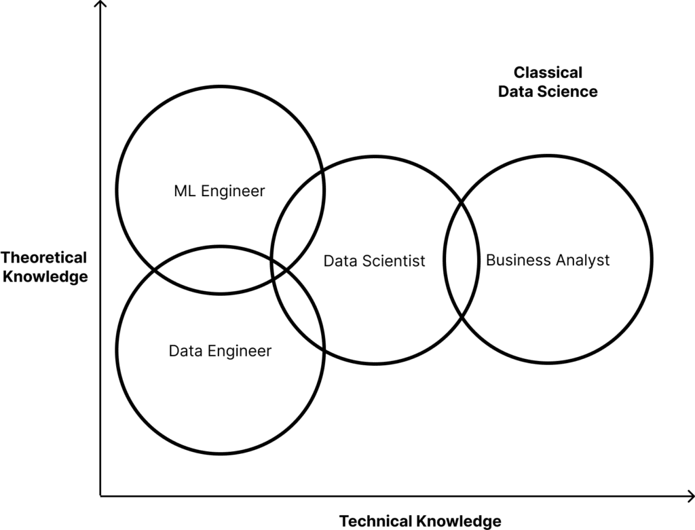
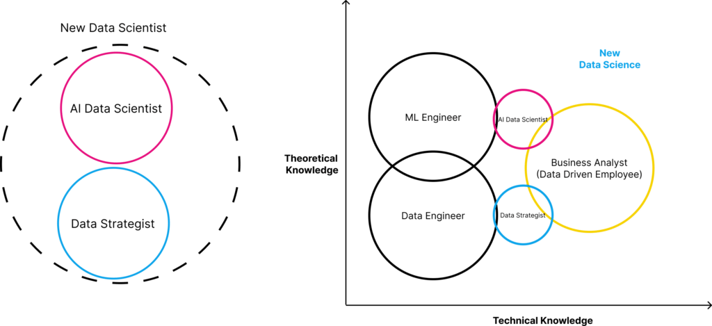
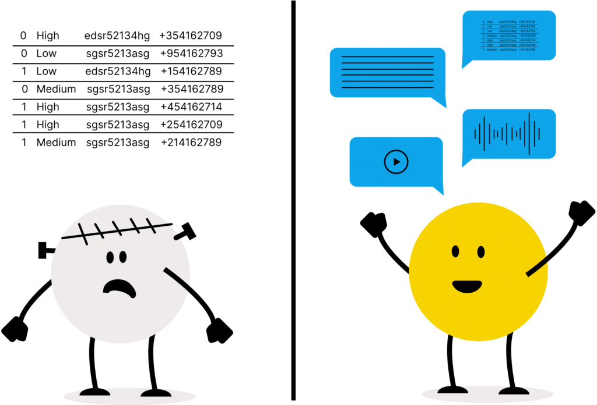

10 years ago, becoming a data scientist was considered the job of the century.

With the consolidation of the Web-2 network, users were not only data consumers but data producers.

The need to manage, process and interpret this new form of gold was paramount and as such, hiring Data Scientists became a high priority for any company that consumed large amounts of data.

These large amounts of user behaviours, network structures, content, demographics, psychographics and much more allowed companies to understand and predict human behaviour at levels never seen before. Data Scientists were at the front of the data stream process that allowed us to bring “life” to data.

By “life”, I am metaphorically referring to Generative AI, as the ultimate emulation of human behaviour that AI has achieved.

However, curiously, as in Mary Shelley's Frankenstein, the newly born creature, involuntary kills its creator.

Between 2022 and 2023 over [500,000 layoffs](https://www.stratascratch.com/blog/data-science-in-2024-what-has-changed/) occurred across all tech jobs globally, with over 30% of those layoffs affecting engineering and data science roles. This is not solely caused by high interest rates and their impact on the tech industry but also by the necessity for [specialisation in this area](https://365datascience.com/career-advice/data-scientist-job-market/), due to the rapid evolution of the available AI technologies.

.elementor-12941 .elementor-element.elementor-element-e56f4e6{--display:flex;--flex-direction:column;--container-widget-width:100%;--container-widget-height:initial;--container-widget-flex-grow:0;--container-widget-align-self:initial;--background-transition:0.3s;}.elementor-12941 .elementor-element.elementor-element-f8d1905{--box-background-color:var( --e-global-color-f6f9b04 );--box-border-color:var( --e-global-color-secondary );--box-border-width:1px;--box-border-radius:12px;--box-padding:12px;--header-color:var( --e-global-color-text );--separator-width:0px;--item-text-decoration:underline;--item-text-hover-decoration:underline;--marker-color:var( --e-global-color-primary );--marker-size:5px;}.elementor-12941 .elementor-element.elementor-element-f8d1905 .elementor-toc\_\_spinner{color:var( --e-global-color-secondary );fill:var( --e-global-color-secondary );}.elementor-12941 .elementor-element.elementor-element-f8d1905 .elementor-toc\_\_header, .elementor-12941 .elementor-element.elementor-element-f8d1905 .elementor-toc\_\_header-title{font-family:"Poppins", sans-serif;font-size:2.25rem;font-weight:700;text-transform:capitalize;line-height:1.2;}.elementor-12941 .elementor-element.elementor-element-f8d1905 .elementor-toc\_\_list-item{font-family:var( --e-global-typography-45f602c-font-family ), sans-serif;font-size:var( --e-global-typography-45f602c-font-size );font-weight:var( --e-global-typography-45f602c-font-weight );line-height:var( --e-global-typography-45f602c-line-height );letter-spacing:var( --e-global-typography-45f602c-letter-spacing );word-spacing:var( --e-global-typography-45f602c-word-spacing );}.elementor-12941 .elementor-element.elementor-element-f8d1905 > .elementor-widget-container{padding:32px 32px 32px 32px;}@media(max-width:1024px){.elementor-12941 .elementor-element.elementor-element-f8d1905 .elementor-toc\_\_list-item{font-size:var( --e-global-typography-45f602c-font-size );line-height:var( --e-global-typography-45f602c-line-height );letter-spacing:var( --e-global-typography-45f602c-letter-spacing );word-spacing:var( --e-global-typography-45f602c-word-spacing );}}@media(max-width:767px){.elementor-12941 .elementor-element.elementor-element-f8d1905 .elementor-toc\_\_list-item{font-size:var( --e-global-typography-45f602c-font-size );line-height:var( --e-global-typography-45f602c-line-height );letter-spacing:var( --e-global-typography-45f602c-letter-spacing );word-spacing:var( --e-global-typography-45f602c-word-spacing );}} /\*! elementor-pro - v3.19.0 - 26-02-2024 \*/  .elementor-widget-table-of-contents .elementor-toc\_\_header-title{color:var(--header-color)}.elementor-widget-table-of-contents.elementor-toc--collapsed .elementor-toc\_\_toggle-button--collapse,.elementor-widget-table-of-contents:not(.elementor-toc--collapsed) .elementor-toc\_\_toggle-button--expand{display:none}.elementor-widget-table-of-contents .elementor-widget-container{min-height:var(--box-min-height);border:var(--box-border-width,1px) solid var(--box-border-color,#9da5ae);border-radius:var(--box-border-radius,3px);background-color:var(--box-background-color);transition:min-height .4s;overflow:hidden}.elementor-toc\_\_header{display:flex;align-items:center;justify-content:space-between;padding:var(--box-padding,20px);background-color:var(--header-background-color);border-bottom:var(--separator-width,1px) solid var(--box-border-color,#9da5ae)}.elementor-toc\_\_header-title{font-size:18px;margin:0;color:var(--header-color)}.elementor-toc\_\_toggle-button{cursor:pointer;display:inline-flex}.elementor-toc\_\_toggle-button i{color:var(--toggle-button-color)}.elementor-toc\_\_toggle-button svg{height:1em;width:1em;fill:var(--toggle-button-color)}.elementor-toc\_\_spinner-container{text-align:center}.elementor-toc\_\_spinner{font-size:2em}.elementor-toc\_\_spinner.e-font-icon-svg{height:1em;width:1em}.elementor-toc\_\_body{padding:var(--box-padding,20px);max-height:var(--toc-body-max-height);overflow-y:auto}.elementor-toc\_\_body::-webkit-scrollbar{width:7px}.elementor-toc\_\_body::-webkit-scrollbar-thumb{background-color:#babfc5;border-radius:10px}.elementor-toc\_\_list-wrapper{list-style:none;padding:0}.elementor-toc\_\_list-item{margin-bottom:.5em}.elementor-toc\_\_list-item.elementor-item-active{font-weight:700}.elementor-toc\_\_list-item .elementor-toc\_\_list-wrapper{margin-top:.5em;margin-left:var(--nested-list-indent,1em)}.elementor-toc\_\_list-item-text:hover{color:var(--item-text-hover-color);-webkit-text-decoration:var(--item-text-hover-decoration);text-decoration:var(--item-text-hover-decoration)}.elementor-toc\_\_list-item-text.elementor-item-active{color:var(--item-text-active-color);-webkit-text-decoration:var(--item-text-active-decoration);text-decoration:var(--item-text-active-decoration)}.elementor-toc\_\_list-item-text-wrapper{display:flex;align-items:center}.elementor-toc\_\_list-item-text-wrapper:before,.elementor-toc\_\_list-item-text-wrapper i{margin-right:8px;color:var(--marker-color)}.elementor-toc\_\_list-item-text-wrapper svg{margin-right:8px;fill:var(--marker-color);height:var(--marker-size,.5em);width:var(--marker-size,.5em)}.elementor-toc\_\_list-item-text-wrapper i{font-size:var(--marker-size,.5em)}.elementor-toc\_\_list-item-text-wrapper:before{font-size:var(--marker-size,1em)}.elementor-toc--content-ellipsis .elementor-toc\_\_list-item-text{white-space:nowrap;overflow:hidden;text-overflow:ellipsis}.elementor-toc\_\_list-items--collapsible>.elementor-toc\_\_list-wrapper>.elementor-toc\_\_list-item>.elementor-toc\_\_list-wrapper{display:none}.elementor-toc\_\_heading-anchor{position:absolute}.elementor-toc\_\_body .elementor-toc\_\_list-item-text{color:var(--item-text-color);-webkit-text-decoration:var(--item-text-decoration);text-decoration:var(--item-text-decoration)}.elementor-toc\_\_body .elementor-toc\_\_list-item-text:hover{color:var(--item-text-hover-color);-webkit-text-decoration:var(--item-text-hover-decoration);text-decoration:var(--item-text-hover-decoration)}.elementor-toc\_\_body .elementor-toc\_\_list-item-text.elementor-item-active{color:var(--item-text-active-color);-webkit-text-decoration:var(--item-text-active-decoration);text-decoration:var(--item-text-active-decoration)}ol.elementor-toc\_\_list-wrapper{counter-reset:item}ol.elementor-toc\_\_list-wrapper .elementor-toc\_\_list-item{counter-increment:item}ol.elementor-toc\_\_list-wrapper .elementor-toc\_\_list-item-text-wrapper:before{content:counters(item,".") ". "}

#### Contents

## What Happened to the Role of the Data Scientist?

Typically, the role of the data scientist primarily revolved around extracting insights from data, building predictive models, and optimising business processes using statistical analysis and machine learning algorithms.

This involved an initial learning curve into the technicalities of predictive analysis and the Extract Transform Load (ETL) process. Statistics, Maths, Programming, Machine Learning understanding, Data Engineering and Visualisation were the key skills for a successful career in Data Science.

However, with the widespread adoption of generative AI - most of these tasks can now be easily implemented into new levels of abstraction, with less code and a seamless infrastructure.

Tools, like [Pecan](https://www.pecan.ai/), [Altair](https://altair.com/data-analytics) and [Rivery](https://rivery.io/), very easily streamline the whole process of data into comprehensible business insights. This makes the technical aspect of the Data Scientist less relevant than intuition and business vision.

Big tech companies like Google, Microsoft and Amazon make it very easy for anyone with a superficial knowledge of programming and statistics to deliver powerful analysis that 10 years ago would require a deeper knowledge. This is a paradigm shift for those invested in such a career path.

Pronouncing the Data Scientists as dead might be a stretch, but certainly, a lot will change.

Let's explore what the career landscape is like for them moving forward.

.elementor-16757 .elementor-element.elementor-element-fa6400f{--display:flex;--flex-direction:column;--container-widget-width:100%;--container-widget-height:initial;--container-widget-flex-grow:0;--container-widget-align-self:initial;--overflow:hidden;--background-transition:0.3s;--border-radius:12px 12px 12px 12px;}.elementor-16757 .elementor-element.elementor-element-283e311{--display:flex;--flex-direction:row;--container-widget-width:initial;--container-widget-height:100%;--container-widget-flex-grow:1;--container-widget-align-self:stretch;--gap:64px 64px;--background-transition:0.3s;}.elementor-16757 .elementor-element.elementor-element-283e311:not(.elementor-motion-effects-element-type-background), .elementor-16757 .elementor-element.elementor-element-283e311 > .elementor-motion-effects-container > .elementor-motion-effects-layer{background-color:#F4FAFE;}.elementor-16757 .elementor-element.elementor-element-283e311, .elementor-16757 .elementor-element.elementor-element-283e311::before{--border-transition:0.3s;}.elementor-16757 .elementor-element.elementor-element-857117e{--display:flex;--flex-direction:row;--container-widget-width:initial;--container-widget-height:100%;--container-widget-flex-grow:1;--container-widget-align-self:stretch;--background-transition:0.3s;}.elementor-16757 .elementor-element.elementor-element-857117e.e-con{--flex-grow:0;--flex-shrink:0;}.elementor-16757 .elementor-element.elementor-element-e6af329 img{width:100%;max-width:100%;height:100%;object-fit:cover;object-position:bottom right;}.elementor-16757 .elementor-element.elementor-element-e6af329{width:100%;max-width:100%;bottom:-44px;}body:not(.rtl) .elementor-16757 .elementor-element.elementor-element-e6af329{right:0px;}body.rtl .elementor-16757 .elementor-element.elementor-element-e6af329{left:0px;}.elementor-16757 .elementor-element.elementor-element-ec0de51{--display:flex;--flex-direction:column;--container-widget-width:100%;--container-widget-height:initial;--container-widget-flex-grow:0;--container-widget-align-self:initial;--gap:24px 24px;--background-transition:0.3s;--padding-block-start:112px;--padding-block-end:112px;--padding-inline-start:0px;--padding-inline-end:44px;}.elementor-16757 .elementor-element.elementor-element-ec0de51.e-con{--flex-grow:1;--flex-shrink:1;}.elementor-16757 .elementor-element.elementor-element-c168e59{--display:flex;--flex-direction:column;--container-widget-width:100%;--container-widget-height:initial;--container-widget-flex-grow:0;--container-widget-align-self:initial;--background-transition:0.3s;}.elementor-16757 .elementor-element.elementor-element-4aeb8ec .elementor-heading-title{font-family:"Poppins", sans-serif;font-size:32px;font-weight:700;}.elementor-16757 .elementor-element.elementor-element-8e0cd20{color:#000000;}@media(min-width:768px){.elementor-16757 .elementor-element.elementor-element-857117e{--width:360px;}}@media(max-width:767px){.elementor-16757 .elementor-element.elementor-element-283e311{--padding-block-start:40px;--padding-block-end:40px;--padding-inline-start:var(--safe-margin);--padding-inline-end:var(--safe-margin);}.elementor-16757 .elementor-element.elementor-element-857117e{--min-height:300px;}body:not(.rtl) .elementor-16757 .elementor-element.elementor-element-e6af329{right:0px;}body.rtl .elementor-16757 .elementor-element.elementor-element-e6af329{left:0px;}.elementor-16757 .elementor-element.elementor-element-e6af329{bottom:-76px;}.elementor-16757 .elementor-element.elementor-element-ec0de51{--padding-block-start:40px;--padding-block-end:0px;--padding-inline-start:0px;--padding-inline-end:0px;}}

##### Looking to Integrate AI into Your Business?

/\*! elementor - v3.19.0 - 28-02-2024 \*/  .elementor-widget-text-editor.elementor-drop-cap-view-stacked .elementor-drop-cap{background-color:#69727d;color:#fff}.elementor-widget-text-editor.elementor-drop-cap-view-framed .elementor-drop-cap{color:#69727d;border:3px solid;background-color:transparent}.elementor-widget-text-editor:not(.elementor-drop-cap-view-default) .elementor-drop-cap{margin-top:8px}.elementor-widget-text-editor:not(.elementor-drop-cap-view-default) .elementor-drop-cap-letter{width:1em;height:1em}.elementor-widget-text-editor .elementor-drop-cap{float:left;text-align:center;line-height:1;font-size:50px}.elementor-widget-text-editor .elementor-drop-cap-letter{display:inline-block}

Get straight to the point, jargon-free advice on transforming your tech strategy by leveraging AI from an expert that has been building award-winning Startups for the past 10 years.

Let's Talk

## A Smaller Middle Ground - Specialisation

Typically, the data scientist was between a business analyst and a machine-learning/AI engineer. With some knowledge of ML algorithms and AI principles, a Data Scientist would trigger these methods to output insights for the business strategy.

However, this superficial knowledge can now be much more easily supported by GenAI. This leaves the Data Scientist to decide on a new path to stay relevant within an organisation.

The original middle ground position between a very technical team(ML/AI/Data engineering)and a not-so-technical one (Business) will require way fewer people. Therefore, the new data scientist will have to revert to either one of the sides of the scale.

### The AI Data Scientist

A logical choice for a reinvention of the role is the specialisation in the technicalities of model creation and model testing.

Machine learning, Data Engineering and AI development will have a strong demand over the coming years. This will most probably be a job more confined to companies specialised in AI and not so much to classical industry companies.

A re-skilling into machine learning principles and methodologies, machine learning ops, data engineering and specific AI fields such as computer vision, NLP, deep learning and so on.

This is a path that will require the capacity to re-skill in a highly theoretical and technical field. It will require a mix of computer science and maths. Moreover, it might turn out to be very difficult if the original data scientific background is grounded on a more superficial understanding of statistics and functional programming.

### The Data Strategist

On the other side, an alternative path for the reinvention of the Data Scientist role is more focused on data strategy and its applications to a company’s operation.

This new data scientist would be more akin to a data enabler. They would envision the whole chain of data acquisition potential within a company’s operations.

They would ensure that this is applied across the whole infrastructure to serve the company’s purposes. With a very strong focus on evangelization, this person would enable all employees to work with data, acting as data translators to the overall company data strategy.

Companies now don’t solely act on classical user data, which more or less comes in a regular way, but also on their own data to gather insights into operation improvement.

Concepts like Process Mining are becoming more popular, where internal processes are converted into data points that can then generate insights.

### The Data-Driven Employee

As generative AI gets more and more ingrained within business operations, data becomes the new fuel for performance.

This means that data can no longer be seen as the property of a small team but as a commodity used by everyone in the company. Hence, Data Science will have to become a company-wide discipline.

New AI models will allow us to transform data that previously would be hard to evaluate given its qualitative nature, into a comprehensive categorisation/evaluation with very little effort.

Basically, we can now harvest almost all types of data (events, content, audio, image and video, etc) to produce insights.

Each employee will not only be a data consumer but also an avid data producer - and as such - it will have to be part of their responsibility to curate their own data pipeline to its full potential.

 

/\*! elementor-pro - v3.19.0 - 26-02-2024 \*/  .elementor-button.elementor-hidden,.elementor-hidden{display:none}.e-form\_\_step{width:100%}.e-form\_\_step:not(.elementor-hidden){display:flex;flex-wrap:wrap}.e-form\_\_buttons{flex-wrap:wrap}.e-form\_\_buttons,.e-form\_\_buttons\_\_wrapper{display:flex}.e-form\_\_indicators{display:flex;justify-content:space-between;align-items:center;flex-wrap:nowrap;font-size:13px;margin-bottom:var(--e-form-steps-indicators-spacing)}.e-form\_\_indicators\_\_indicator{display:flex;flex-direction:column;align-items:center;justify-content:center;flex-basis:0;padding:0 var(--e-form-steps-divider-gap)}.e-form\_\_indicators\_\_indicator\_\_progress{width:100%;position:relative;background-color:var(--e-form-steps-indicator-progress-background-color);border-radius:var(--e-form-steps-indicator-progress-border-radius);overflow:hidden}.e-form

   Full Name  Business Email  Subscribe

## The Impact on Future Product Development

In the evolving landscape of business operations, every product is now compelled to integrate data considerations beyond the classical event-based Key Performance Indicators (KPIs).

No longer can product development solely rely on conventional metrics; instead, they must delve into the intricate layers of user behaviour, preferences, and feedback to stay competitive.

For instance, it may not be enough for an e-commerce platform to analyse the number of purchases alone. Rather, they will need to also look at browsing patterns, wishlists, and even sentiment analysis from customer reviews to optimise its offerings.

The new AI data scientist emerges as a pivotal figure in supporting product teams to envision these core layers.

With their expertise in machine learning, data engineering, and AI development, they can guide product development by leveraging advanced analytics to understand user needs and predict market trends.

By harnessing the power of generative AI and data-driven insights, product teams can iterate faster, tailor offerings to individual preferences, and ultimately enhance user experiences.

Companies poised for success are those that can adeptly collect, manage, and profit from their own generated data.

With the aid of generative AI-driven analytics and the strategic guidance of data experts, product development can transcend traditional boundaries, leading to more innovative and competitive offerings.

## Conclusion

The trajectory of the Data Scientist has undergone a profound shift, evolving from a mere data insight generator to a crucial enabler of organizational success in the data-driven era.

As the demand for data-driven decision-making permeates every aspect of business, Data Scientists must choose between two key options.

1. Embracing a more theoretical role
2. Adopting a strategic stance in delivering value to a workforce increasingly versed in data literacy.

While the traditional notion of the Data Scientist may seem obsolete, it's only set to resurface within a different data paradigm.

Armed with new skills and perspectives, these professionals stand at the forefront of driving innovation, shaping strategies, and empowering organizations to thrive in the data-centric future.
