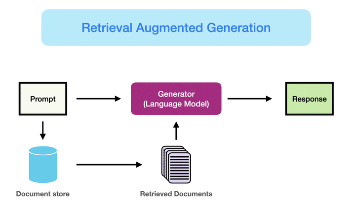
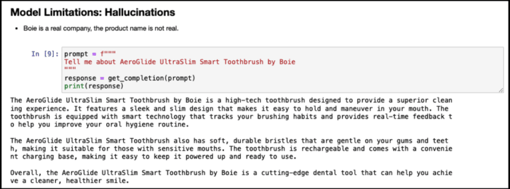
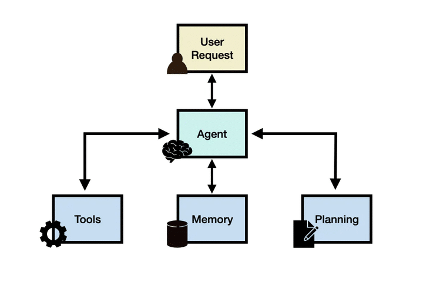
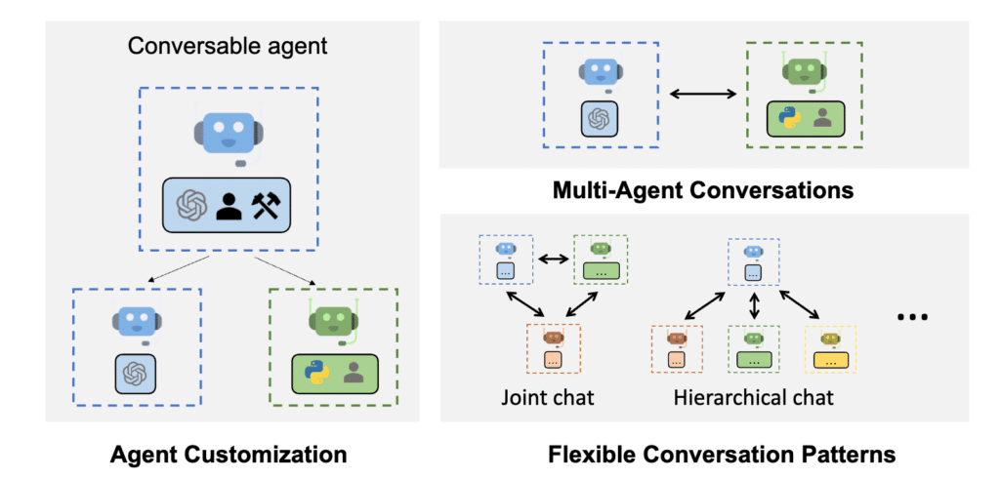
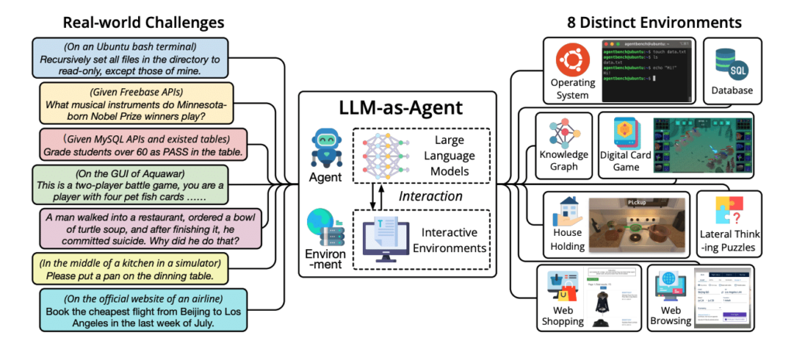

#### Game-changing AI agents 

AI Agents promise incredible benefits when it comes to streamlining operations and reducing the need for human touch in increasingly complex tasks. 

It is early days, and we see innovative companies already report tremendous cost reductions and efficiency gains from deploying this technology. 

An example of this is [Klarna](https://www.klarna.com/). 

The Fintech company, in collaboration with OpenAI, has implemented autonomous agents across their customer support operation. 

Just one month after implementation, they reported a **reduction in average resolution time from 11 to 2 minutes!**

Their implementation was able to engage in 2.3M conversations with customers, handling two-thirds of all customer service interactions, and leaving only the most complex cases for humans to resolve. Their agents performed the equivalent work of 700 full-time employees. Insane results!

I will share Klarna’s report at the end, but, if you are a start-up founder, it should be very clear that staying competitive requires you to get familiar with these tools and leverage them in your business.

AI agents will change the structure of organisations, and [according to Sam Altman, open up the possibility for one-person unicorns](https://fortune.com/2024/02/04/sam-altman-one-person-unicorn-silicon-valley-founder-myth/).

In this article, I will leave you with:

1. An overview of relevant concepts to understand AI agents: LLM, Chain, RAG, Agent, and Multi-Agent Systems (MAS).
2. A comprehensive list of leading tools to try out
3. A list of performance benchmarks showcasing current capabilities and limitations

.elementor-12941 .elementor-element.elementor-element-e56f4e6{--display:flex;--flex-direction:column;--container-widget-width:100%;--container-widget-height:initial;--container-widget-flex-grow:0;--container-widget-align-self:initial;--background-transition:0.3s;}.elementor-12941 .elementor-element.elementor-element-f8d1905{--box-background-color:var( --e-global-color-f6f9b04 );--box-border-color:var( --e-global-color-secondary );--box-border-width:1px;--box-border-radius:12px;--separator-width:0px;--box-padding:12px;--header-color:var( --e-global-color-text );--item-text-decoration:underline;--item-text-hover-decoration:underline;--marker-color:var( --e-global-color-primary );--marker-size:5px;}.elementor-12941 .elementor-element.elementor-element-f8d1905 .elementor-toc\_\_spinner{color:var( --e-global-color-secondary );fill:var( --e-global-color-secondary );}.elementor-12941 .elementor-element.elementor-element-f8d1905 .elementor-toc\_\_header-title{text-align:start;}.elementor-12941 .elementor-element.elementor-element-f8d1905 .elementor-toc\_\_header, .elementor-12941 .elementor-element.elementor-element-f8d1905 .elementor-toc\_\_header-title{font-family:"Poppins", sans-serif;font-size:2.25rem;font-weight:700;text-transform:capitalize;line-height:1.2;}.elementor-12941 .elementor-element.elementor-element-f8d1905 .elementor-toc\_\_list-item{font-family:var( --e-global-typography-45f602c-font-family ), sans-serif;font-size:var( --e-global-typography-45f602c-font-size );font-weight:var( --e-global-typography-45f602c-font-weight );line-height:var( --e-global-typography-45f602c-line-height );letter-spacing:var( --e-global-typography-45f602c-letter-spacing );word-spacing:var( --e-global-typography-45f602c-word-spacing );}.elementor-12941 .elementor-element.elementor-element-f8d1905 > .elementor-widget-container{padding:32px 32px 32px 32px;}@media(max-width:1024px){.elementor-12941 .elementor-element.elementor-element-f8d1905 .elementor-toc\_\_list-item{font-size:var( --e-global-typography-45f602c-font-size );line-height:var( --e-global-typography-45f602c-line-height );letter-spacing:var( --e-global-typography-45f602c-letter-spacing );word-spacing:var( --e-global-typography-45f602c-word-spacing );}}@media(max-width:767px){.elementor-12941 .elementor-element.elementor-element-f8d1905 .elementor-toc\_\_list-item{font-size:var( --e-global-typography-45f602c-font-size );line-height:var( --e-global-typography-45f602c-line-height );letter-spacing:var( --e-global-typography-45f602c-letter-spacing );word-spacing:var( --e-global-typography-45f602c-word-spacing );}}

#### Contents

## Concept Overview: LLM-based Systems 

An AI agent, simply put, is an LLM-based system capable of handling tasks that require multiple undefined steps.

An agent can reason about what would be required in order to solve the prompted task and come up with a plan. It then generates prompted calls to specific LLMs to resolve the different parts of the plan.

At the frontier of LLM-based systems, is the concept of Multi-Agent Systems (MAS), where multiple “expert autonomous agents” are capable of collaboration, dialogue, and access to tools for joint problem-solving.

In this section, I will go through the different types of LLM-based systems, with increasing levels of complexity. Compare this with the tasks you want to automate via an AI agent and you will have a clear picture of what you need to implement.

### LLM

Large Language Models we use today started as what we call now Base LLMs, which were models trained to predict the next token (set of characters), based on a large dataset of text from the internet.

Base LLM models would do a good job at predicting the next set of characters, but would have a limited awareness of whether the output was true or false. It would often come up with wrong facts or “hallucinate” the response.

To improve model quality, a second generation of models called [Instruction tuned LLMs](https://arxiv.org/html/2308.10792v5) emerged.

Instruction Tuned LLMs were built on top of Base LLMs and improved with Reinforcement Learning with Human Feedback (RLHF) to increase the quality of answers. 

This has brought us to the race for model quality that is currently happening, with frequent releases of new model versions - ChatGPT, Claude, Llama, and more.

Model quality has come a long way, but it is still far from perfect. To emphasise this point, see the graph below [provided by Anthropic](https://www.anthropic.com/news/claude-3-family) on the accuracy of their most advanced models when solving “hard questions”:

LLMs can be prompted in many ways to improve output quality. However, it might be the case that you want your system to execute multiple tasks in a row, given only one prompt. This is where chains come in.

### Chain

A Chain is a sequence of calls to an LLM, a tool, or a data preprocessing step. 

Chains allow for the completion of more complex tasks than a simple LLM, given that they can receive the output of a previous task as input to the next task, triggering a sequence of events.

**In a chain, the sequence of sub-tasks necessary to resolve a prompted meta-task is hardcoded.** 

Implementing a chain means:

1. Ability to tackle complex tasks by resorting to a sequence of sub-tasks
2. Higher control over the sub-tasks and output 
3. Higher robustness, given a hard-coded strategy
4. Less adaptability, given a hard-coded strategy

/\* widget: Blog: Simple Box \*/ /\* reset -------------------- \*/ .blog-custom-block \*, .blog-custom-block ::before, .blog-custom-block ::after { box-sizing: border-box; border-width: 0; border-style: solid; border-color: #e5e7eb; } /\* vars -------------------- \*/ .blog-custom-block.blog-custom-block\_\_simple-quote { --color-accent: #0FA4EA; --color-bg: #F4FAFE; --color-text-2: #4A4A68; } /\* colors -------------------- \*/ .blog-custom-block.blog-custom-block\_\_simple-quote .bg-clr-bg { background-color: var(--color-bg); } .blog-custom-block.blog-custom-block\_\_simple-quote .border-clr-accent { border-color: var(--color-accent); } .blog-custom-block.blog-custom-block\_\_simple-quote .text-clr-text-2 { color: var(--color-text-2); } /\* utils -------------------- \*/ .blog-custom-block.blog-custom-block\_\_simple-quote .flex { display: flex; } .blog-custom-block.blog-custom-block\_\_simple-quote .flex-shrink-0 { flex-shrink: 0; } .blog-custom-block.blog-custom-block\_\_simple-quote .flex-col { flex-direction: column; } .blog-custom-block.blog-custom-block\_\_simple-quote .gap-4 { gap: 1rem; } .blog-custom-block.blog-custom-block\_\_simple-quote .rounded-xl { border-radius: 0.75rem; } .blog-custom-block.blog-custom-block\_\_simple-quote .border-l-6 { border-left-width: 6px; } .blog-custom-block.blog-custom-block\_\_simple-quote .p-8 { padding: 2rem; } .blog-custom-block.blog-custom-block\_\_simple-quote .text-xl { font-size: 1.25rem; line-height: 1.75rem; } .blog-custom-block.blog-custom-block\_\_simple-quote .italic { font-style: italic; }

If you’d like to learn how to implement a chain, check out this [gentle introduction to chaining LLMs and utils via Langchain](https://towardsdatascience.com/a-gentle-intro-to-chaining-llms-agents-and-utils-via-langchain-16cd385fca81).

### Retrieval Augmented Generation (RAG)

**[RAG](https://stackoverflow.blog/2023/10/18/retrieval-augmented-generation-keeping-llms-relevant-and-current/)** refers to an LLM-based system where the LLM is provided access to a set of documents, allowing the model to find and fetch relevant information to inform the generation of answers.

Instruction-tuned LLMs are significantly better performing at generating responses than Base LLMs, but still, hallucinations happen. A good example of **hallucination** is when a model is asked to talk about a product that does not exist, from a company that exists:

In order to resolve such cases, RAG systems are one of the most popular approaches. 

In comparison to using a simple LLM, a RAG system provides:

1. Reduced hallucination
2. More control over the output
3. Explainability
4. Access to proprietary/private information to inform responses

To implement a simple RAG - see this [Stack Overflow blog post on RAG.](https://stackoverflow.blog/2023/10/18/retrieval-augmented-generation-keeping-llms-relevant-and-current/)

/\* widget: Blog: Small Topic \*/ /\* reset -------------------- \*/ .blog-custom-block \*, .blog-custom-block ::before, .blog-custom-block ::after { box-sizing: border-box; border-width: 0; border-style: solid; border-color: #e5e7eb; } /\* vars -------------------- \*/ .blog-custom-block.blog-custom-block\_\_small-topic { --color-accent: #E7107E; --color-bg: #F4FAFE; --color-text-1: #0F172A; } /\* colors -------------------- \*/ .blog-custom-block.blog-custom-block\_\_small-topic .bg-clr-bg { background-color: var(--color-bg); } .blog-custom-block.blog-custom-block\_\_small-topic .text-clr-accent { color: var(--color-accent); } .blog-custom-block.blog-custom-block\_\_small-topic .text-clr-text-1 { color: var(--color-text-1); } /\* utils -------------------- \*/ .blog-custom-block.blog-custom-block\_\_small-topic .mt-2 { margin-top: 0.5rem; } .blog-custom-block.blog-custom-block\_\_small-topic .flex { display: flex; } .blog-custom-block.blog-custom-block\_\_small-topic .flex-shrink-0 { flex-shrink: 0; } .blog-custom-block.blog-custom-block\_\_small-topic .flex-col { flex-direction: column; } .blog-custom-block.blog-custom-block\_\_small-topic .items-center { align-items: center; } .blog-custom-block.blog-custom-block\_\_small-topic .p-5 { padding: 1.25rem; } .blog-custom-block.blog-custom-block\_\_small-topic .gap-4 { gap: 1rem; } .blog-custom-block.blog-custom-block\_\_small-topic .gap-5 { gap: 1.25rem; } .blog-custom-block.blog-custom-block\_\_small-topic .rounded-xl { border-radius: 0.75rem; } .blog-custom-block.blog-custom-block\_\_small-topic .p-8 { padding: 2rem; } .blog-custom-block.blog-custom-block\_\_small-topic .text-xl { font-size: 1.25rem; line-height: 1.75rem; } .blog-custom-block.blog-custom-block\_\_small-topic .font-bold { font-weight: 700; } Related: [How To Use AI to Track Your Startup’s KPIs, Enhance Ops and Impress Investors](https://altar.io/use-ai-track-startup-kpis/)

### Autonomous AI Agents

**AI Agents** are capable of splitting the task given in a prompt into sub-tasks and triggering the execution of those sub-tasks. 

Unlike chains, where the sub-tasks are hardcoded, agents can figure out which sub-tasks are needed to resolve the meta-task, coming up with a plan.

Agents provide a similar reliability of output to RAG systems for their ability to fetch information from a set of pre-selected documents.  However, Agents can tackle more complex tasks. 

Agents can:

1. Break a prompted task into sub-tasks
2. Figure out which tools and documents are needed to complete each sub-tasks
3. Plan the execution of sub-tasks
4. Access tools & documents as needed for each sub-task
5. Orchestrate the execution of sub-tasks

  /\* widget: Blog: Simple Box \*/ /\* reset -------------------- \*/ .blog-custom-block \*, .blog-custom-block ::before, .blog-custom-block ::after { box-sizing: border-box; border-width: 0; border-style: solid; border-color: #e5e7eb; } /\* vars -------------------- \*/ .blog-custom-block.blog-custom-block\_\_simple-quote { --color-accent: #0FA4EA; --color-bg: #F4FAFE; --color-text-2: #4A4A68; } /\* colors -------------------- \*/ .blog-custom-block.blog-custom-block\_\_simple-quote .bg-clr-bg { background-color: var(--color-bg); } .blog-custom-block.blog-custom-block\_\_simple-quote .border-clr-accent { border-color: var(--color-accent); } .blog-custom-block.blog-custom-block\_\_simple-quote .text-clr-text-2 { color: var(--color-text-2); } /\* utils -------------------- \*/ .blog-custom-block.blog-custom-block\_\_simple-quote .flex { display: flex; } .blog-custom-block.blog-custom-block\_\_simple-quote .flex-shrink-0 { flex-shrink: 0; } .blog-custom-block.blog-custom-block\_\_simple-quote .flex-col { flex-direction: column; } .blog-custom-block.blog-custom-block\_\_simple-quote .gap-4 { gap: 1rem; } .blog-custom-block.blog-custom-block\_\_simple-quote .rounded-xl { border-radius: 0.75rem; } .blog-custom-block.blog-custom-block\_\_simple-quote .border-l-6 { border-left-width: 6px; } .blog-custom-block.blog-custom-block\_\_simple-quote .p-8 { padding: 2rem; } .blog-custom-block.blog-custom-block\_\_simple-quote .text-xl { font-size: 1.25rem; line-height: 1.75rem; } .blog-custom-block.blog-custom-block\_\_simple-quote .italic { font-style: italic; }

An example of a prompt that would not be solvable by a simple RAG or LLM, that AI Agents can tackle is the following:

_**"How has the trend in the average daily calorie intake among adults changed over the last decade in the United States, and what impact might this have on obesity rates?**_  
  
_**Additionally, can you provide a graphical representation of the trend in obesity rates over this period?"**_

To resolve this prompt, an AI agent might:

1. Access Search API tool
2. Access health-related publications
3. Access public/private health databases
4. Access the “code interpreter” tool
5. Generate useful charts on obesity trends

If we wanted to resolve a similar problem consistently, say for every country in the world, a Chain would be a good idea. It would allow us to have control over the sequence of sub-tasks, and tools to use, and optimise the process for the best results.

### Multi-Agent Systems (MAS)

Agents are fantastic. Still, like humans, they can’t become an expert in everything.

Much like hiring a new intern for your company, an Agent will be as good as the specificity of the tasks requested of him. And, teamwork leads to the best results. Here is where Multi-Agent Systems comes in.

**Multi-Agent Systems (MAS)** are teams of Autonomous AI Agents, which can independently specialise in handling specific tasks and can interact, collaborate and negotiate towards the resolution of high-level tasks.

Some of the benefits of MAS are increases in:

1. **Performance:** Mix of Experts approach
2. **Robustness:** You can add QA AI agents to the system
3. **Scalability:** Parallel processing, spin-up of AI agents as needed

Multi-agent systems can be fully autonomous - solving the request from an initial prompt without additional human input - or request human input between steps. 

Making these systems “semi-automatic” at first is useful for fine-tuning the system. In some cases, human input is imperative. In others, once the system is consistently performing as required, full automation is possible. You can set the human feedback option as a parameter in most, if not all, of the frameworks.

.elementor-16757 .elementor-element.elementor-element-fa6400f{--display:flex;--flex-direction:column;--container-widget-width:100%;--container-widget-height:initial;--container-widget-flex-grow:0;--container-widget-align-self:initial;--overflow:hidden;--background-transition:0.3s;--border-radius:12px 12px 12px 12px;}.elementor-16757 .elementor-element.elementor-element-283e311{--display:flex;--flex-direction:row;--container-widget-width:initial;--container-widget-height:100%;--container-widget-flex-grow:1;--container-widget-align-self:stretch;--gap:64px 64px;--background-transition:0.3s;}.elementor-16757 .elementor-element.elementor-element-283e311:not(.elementor-motion-effects-element-type-background), .elementor-16757 .elementor-element.elementor-element-283e311 > .elementor-motion-effects-container > .elementor-motion-effects-layer{background-color:#F4FAFE;}.elementor-16757 .elementor-element.elementor-element-283e311, .elementor-16757 .elementor-element.elementor-element-283e311::before{--border-transition:0.3s;}.elementor-16757 .elementor-element.elementor-element-857117e{--display:flex;--flex-direction:row;--container-widget-width:initial;--container-widget-height:100%;--container-widget-flex-grow:1;--container-widget-align-self:stretch;--background-transition:0.3s;}.elementor-16757 .elementor-element.elementor-element-857117e.e-con{--flex-grow:0;--flex-shrink:0;}.elementor-16757 .elementor-element.elementor-element-e6af329 img{width:100%;max-width:100%;height:100%;object-fit:cover;object-position:bottom right;}.elementor-16757 .elementor-element.elementor-element-e6af329{width:100%;max-width:100%;bottom:-44px;}body:not(.rtl) .elementor-16757 .elementor-element.elementor-element-e6af329{right:0px;}body.rtl .elementor-16757 .elementor-element.elementor-element-e6af329{left:0px;}.elementor-16757 .elementor-element.elementor-element-ec0de51{--display:flex;--flex-direction:column;--container-widget-width:100%;--container-widget-height:initial;--container-widget-flex-grow:0;--container-widget-align-self:initial;--gap:24px 24px;--background-transition:0.3s;--padding-top:112px;--padding-bottom:112px;--padding-left:0px;--padding-right:44px;}.elementor-16757 .elementor-element.elementor-element-ec0de51.e-con{--flex-grow:1;--flex-shrink:1;}.elementor-16757 .elementor-element.elementor-element-c168e59{--display:flex;--flex-direction:column;--container-widget-width:100%;--container-widget-height:initial;--container-widget-flex-grow:0;--container-widget-align-self:initial;--background-transition:0.3s;}.elementor-16757 .elementor-element.elementor-element-4aeb8ec .elementor-heading-title{font-family:"Poppins", sans-serif;font-size:32px;font-weight:700;}.elementor-16757 .elementor-element.elementor-element-8e0cd20{color:#000000;}@media(min-width:768px){.elementor-16757 .elementor-element.elementor-element-857117e{--width:360px;}}@media(max-width:767px){.elementor-16757 .elementor-element.elementor-element-283e311{--padding-top:40px;--padding-bottom:40px;--padding-left:var(--safe-margin);--padding-right:var(--safe-margin);}.elementor-16757 .elementor-element.elementor-element-857117e{--min-height:300px;}body:not(.rtl) .elementor-16757 .elementor-element.elementor-element-e6af329{right:0px;}body.rtl .elementor-16757 .elementor-element.elementor-element-e6af329{left:0px;}.elementor-16757 .elementor-element.elementor-element-e6af329{bottom:-76px;}.elementor-16757 .elementor-element.elementor-element-ec0de51{--padding-top:40px;--padding-bottom:0px;--padding-left:0px;--padding-right:0px;}} 

##### Looking to Integrate AI into Your Business?

Get straight to the point, jargon-free advice on transforming your tech strategy by leveraging AI from an expert that has been building award-winning Startups for the past 10 years.

Let's Talk

## Multi-Agent Frameworks & Tools

In this section, I will go over the latest frameworks and tools you can use to implement your AI Agents and Multi-Agent Systems effectively.

In order to understand how to use each of the frameworks effectively, hands-on experimentation is required. Making little sense to copy all the documentation here, I will simply list the most relevant tools in my view, pointing to the best places to dive deeper into each of the tools, with examples and use cases, where possible.

Here is a list of tools you can test to build AI agents and multi-agent systems:

### AutoGen

AutoGen is a framework by Microsoft that facilitates the development of large language model (LLM) applications using multiple customisable and conversable agents. These agents can interact autonomously or with human feedback to solve complex tasks, integrating LLMs, tools, and human inputs seamlessly. [Documentation](https://microsoft.github.io/autogen/).

### LangGraph

LangGraph offers a graph-based approach to managing interactions between multiple AI agents, enabling complex reasoning and task-solving capabilities. It allows developers to visualise and optimise the interactions and dependencies between various agents. [Learn more](https://blog.langchain.dev/langgraph-multi-agent-workflows/).

### CrewAI

CrewAI is a platform for orchestrating autonomous AI agents in collaborative environments, designed to enhance productivity through multi-agent workflows. It supports various tasks such as web searching, data analysis, and delegation among agents to streamline complex task execution. [Documentation](https://docs.crewai.com/).

Check out this interesting example of LangGraph + Crew AI for automatic email fetching and response draft generation:

https://www.youtube.com/watch?v=OzYdPqzlcPo

### MetaGPT

MetaGPT allows users to deploy GPT-based AI agents capable of performing a variety of tasks, from answering queries to generating content. It leverages the capabilities of GPT models to build responsive and interactive applications, facilitating natural language interactions. [Learn more](https://github.com/geekan/MetaGPT).

### Camel-ai

Camel-ai specialises in creating adaptive AI agents that can learn and evolve. Its framework supports the development of agents that can autonomously adapt to new tasks and environments, enhancing the AI's capability to handle dynamic scenarios. [Learn more](https://github.com/camel-ai/camel).

### Langroid

Langroid is a framework for building modular and scalable AI systems using a collection of specialised agents. It supports the integration of different AI models and tools, providing a flexible infrastructure for developing complex AI applications. [Learn more](https://github.com/langroid/langroid).

/\* widget: Blog: Small Topic \*/ /\* reset -------------------- \*/ .blog-custom-block \*, .blog-custom-block ::before, .blog-custom-block ::after { box-sizing: border-box; border-width: 0; border-style: solid; border-color: #e5e7eb; } /\* vars -------------------- \*/ .blog-custom-block.blog-custom-block\_\_small-topic { --color-accent: #E7107E; --color-bg: #F4FAFE; --color-text-1: #0F172A; } /\* colors -------------------- \*/ .blog-custom-block.blog-custom-block\_\_small-topic .bg-clr-bg { background-color: var(--color-bg); } .blog-custom-block.blog-custom-block\_\_small-topic .text-clr-accent { color: var(--color-accent); } .blog-custom-block.blog-custom-block\_\_small-topic .text-clr-text-1 { color: var(--color-text-1); } /\* utils -------------------- \*/ .blog-custom-block.blog-custom-block\_\_small-topic .mt-2 { margin-top: 0.5rem; } .blog-custom-block.blog-custom-block\_\_small-topic .flex { display: flex; } .blog-custom-block.blog-custom-block\_\_small-topic .flex-shrink-0 { flex-shrink: 0; } .blog-custom-block.blog-custom-block\_\_small-topic .flex-col { flex-direction: column; } .blog-custom-block.blog-custom-block\_\_small-topic .items-center { align-items: center; } .blog-custom-block.blog-custom-block\_\_small-topic .p-5 { padding: 1.25rem; } .blog-custom-block.blog-custom-block\_\_small-topic .gap-4 { gap: 1rem; } .blog-custom-block.blog-custom-block\_\_small-topic .gap-5 { gap: 1.25rem; } .blog-custom-block.blog-custom-block\_\_small-topic .rounded-xl { border-radius: 0.75rem; } .blog-custom-block.blog-custom-block\_\_small-topic .p-8 { padding: 2rem; } .blog-custom-block.blog-custom-block\_\_small-topic .text-xl { font-size: 1.25rem; line-height: 1.75rem; } .blog-custom-block.blog-custom-block\_\_small-topic .font-bold { font-weight: 700; } Related: [AI Building Blocks: The Ultimate Guide to Integrating AI into Your Business](https://altar.io/ai-building-blocks-business/)

## Status Quo

### Performance benchmarks

There have been great efforts to create performance leaderboards and scores for LLM performance - see [hugging face leaderboard](https://huggingface.co/spaces/open-llm-leaderboard/open_llm_leaderboard), [LLM Benchmarks explained](https://www.confident-ai.com/blog/llm-benchmarks-mmlu-hellaswag-and-beyond). 

However, evaluating a team of agents is no easy task. 

Several benchmarks have been designed to evaluate LLM agents. Notable examples include [ALFWorld](https://alfworld.github.io/), [IGLU](https://arxiv.org/abs/2304.10750), [Tachikuma](https://arxiv.org/abs/2307.12573), [AgentBench](https://github.com/THUDM/AgentBench), [SocKET](https://arxiv.org/abs/2305.14938), [AgentSims](https://arxiv.org/abs/2308.04026), [ToolBench](https://arxiv.org/abs/2305.16504), [WebShop](https://arxiv.org/abs/2207.01206), [Mobile-Env](https://github.com/stefanbschneider/mobile-env), [WebArena](https://github.com/web-arena-x/webarena), [GentBench](https://arxiv.org/abs/2308.04030), [RocoBench](https://project-roco.github.io/), [EmotionBench](https://project-roco.github.io/), [PEB](https://arxiv.org/abs/2308.06782), [ClemBench](https://arxiv.org/abs/2305.13455), and [E2E.](https://arxiv.org/abs/2308.04624)

For a deeper understanding read “AgentBench benchmark to evaluate LLM-as-Agent on real-world challenges and 8 different environments. Liu, et. all (Oct 2023)" [here](https://arxiv.org/pdf/2308.03688).

 

You can also read “benchmarkname : A Benchmark for LLMs as Intelligent Agents” - Wu, et all. (Mar 2024) [here.](https://arxiv.org/html/2310.01557v5)

### Challenges

LLM agents are still in their early days, and there are several challenges and limitations to consider when developing them.

**Prompt Robustness and Reliability:** An LLM agent often requires several prompts to power different modules, such as memory and planning. Even minor changes to prompts can cause reliability issues. LLM agents use a comprehensive prompt framework, making them susceptible to robustness problems. Potential solutions include iterative prompt crafting, automatic prompt optimisation/tuning, or generating prompts using GPT. Additionally, hallucinations are a common problem, where agents generate inaccurate information due to conflicting external data.

**Knowledge Boundary:** Managing the knowledge scope of LLMs is challenging, which can impact the accuracy of simulations. An LLM's internal knowledge can introduce biases or utilise information unknown to the user, affecting the agent's behaviour in specific scenarios.

**Role-playing Capability:** LLM-based agents often need to adopt specific roles to effectively accomplish tasks within a given domain. For roles that the LLM does not inherently embody well, fine-tuning the LLM with data representing rare roles or psychological profiles can be beneficial.

**Long-term Planning and Finite Context Length:** Planning over an extended history is difficult and can lead to errors that the agent may struggle to correct. Additionally, LLMs have limitations in the length of context they can handle, which can restrict the agent's ability to use short-term memory effectively.

**Efficiency:** LLM agents require numerous requests to be processed by the LLM, which can impact the efficiency of agent actions due to reliance on the LLM's inference speed. Moreover, deploying multiple agents can be costly.

**Human Alignment:** Aligning agents with a wide range of human values is challenging, a problem also seen in standard LLMs. One potential solution is to realign the LLM by creating advanced prompting strategies.

.elementor-3329 .elementor-element.elementor-element-f79b780{--display:flex;--flex-direction:column;--container-widget-width:100%;--container-widget-height:initial;--container-widget-flex-grow:0;--container-widget-align-self:initial;--background-transition:0.3s;}.elementor-3329 .elementor-element.elementor-element-aa6dd2a{--display:flex;--flex-direction:column;--container-widget-width:100%;--container-widget-height:initial;--container-widget-flex-grow:0;--container-widget-align-self:initial;--gap:24px 24px;--background-transition:0.3s;--border-radius:12px 12px 12px 12px;--padding-top:70px;--padding-bottom:70px;--padding-left:var(--safe-margin);--padding-right:var(--safe-margin);}.elementor-3329 .elementor-element.elementor-element-aa6dd2a:not(.elementor-motion-effects-element-type-background), .elementor-3329 .elementor-element.elementor-element-aa6dd2a > .elementor-motion-effects-container > .elementor-motion-effects-layer{background-color:#29293E;}.elementor-3329 .elementor-element.elementor-element-aa6dd2a, .elementor-3329 .elementor-element.elementor-element-aa6dd2a::before{--border-transition:0.3s;}.elementor-3329 .elementor-element.elementor-element-95ae566{--display:flex;--flex-direction:column;--container-widget-width:100%;--container-widget-height:initial;--container-widget-flex-grow:0;--container-widget-align-self:initial;--background-transition:0.3s;}.elementor-3329 .elementor-element.elementor-element-99ebd14{text-align:center;}.elementor-3329 .elementor-element.elementor-element-99ebd14 .elementor-heading-title{color:var( --e-global-color-eb70be1 );font-family:var( --e-global-typography-0ff79ee-font-family ), sans-serif;font-size:var( --e-global-typography-0ff79ee-font-size );font-weight:var( --e-global-typography-0ff79ee-font-weight );line-height:var( --e-global-typography-0ff79ee-line-height );letter-spacing:var( --e-global-typography-0ff79ee-letter-spacing );word-spacing:var( --e-global-typography-0ff79ee-word-spacing );}.elementor-3329 .elementor-element.elementor-element-0ce57c0{text-align:center;color:var( --e-global-color-eb70be1 );font-size:20px;}.elementor-3329 .elementor-element.elementor-element-28db4d7{--display:flex;--flex-direction:row;--container-widget-width:initial;--container-widget-height:100%;--container-widget-flex-grow:1;--container-widget-align-self:stretch;--justify-content:flex-start;--background-transition:0.3s;}.elementor-3329 .elementor-element.elementor-element-70fbc6a .elementor-field-group{padding-right:calc( 24px/2 );padding-left:calc( 24px/2 );margin-bottom:32px;}.elementor-3329 .elementor-element.elementor-element-70fbc6a .elementor-form-fields-wrapper{margin-left:calc( -24px/2 );margin-right:calc( -24px/2 );margin-bottom:-32px;}.elementor-3329 .elementor-element.elementor-element-70fbc6a .elementor-field-group.recaptcha\_v3-bottomleft, .elementor-3329 .elementor-element.elementor-element-70fbc6a .elementor-field-group.recaptcha\_v3-bottomright{margin-bottom:0;}body.rtl .elementor-3329 .elementor-element.elementor-element-70fbc6a .elementor-labels-inline .elementor-field-group > label{padding-left:8px;}body:not(.rtl) .elementor-3329 .elementor-element.elementor-element-70fbc6a .elementor-labels-inline .elementor-field-group > label{padding-right:8px;}body .elementor-3329 .elementor-element.elementor-element-70fbc6a .elementor-labels-above .elementor-field-group > label{padding-bottom:8px;}.elementor-3329 .elementor-element.elementor-element-70fbc6a .elementor-field-group > label, .elementor-3329 .elementor-element.elementor-element-70fbc6a .elementor-field-subgroup label{color:var( --e-global-color-eb70be1 );}.elementor-3329 .elementor-element.elementor-element-70fbc6a .elementor-field-group > label{font-family:var( --e-global-typography-9730a4e-font-family ), sans-serif;font-size:var( --e-global-typography-9730a4e-font-size );font-weight:var( --e-global-typography-9730a4e-font-weight );line-height:var( --e-global-typography-9730a4e-line-height );letter-spacing:var( --e-global-typography-9730a4e-letter-spacing );word-spacing:var( --e-global-typography-9730a4e-word-spacing );}.elementor-3329 .elementor-element.elementor-element-70fbc6a .elementor-field-type-html{padding-bottom:0px;}.elementor-3329 .elementor-element.elementor-element-70fbc6a .elementor-field-group .elementor-field{color:var( --e-global-color-eb70be1 );}.elementor-3329 .elementor-element.elementor-element-70fbc6a .elementor-field-group .elementor-field, .elementor-3329 .elementor-element.elementor-element-70fbc6a .elementor-field-subgroup label{font-family:var( --e-global-typography-text-font-family ), sans-serif;font-size:var( --e-global-typography-text-font-size );font-weight:var( --e-global-typography-text-font-weight );line-height:var( --e-global-typography-text-line-height );}.elementor-3329 .elementor-element.elementor-element-70fbc6a .elementor-field-group:not(.elementor-field-type-upload) .elementor-field:not(.elementor-select-wrapper){background-color:#3D3D5C;border-color:#65639C;}.elementor-3329 .elementor-element.elementor-element-70fbc6a .elementor-field-group .elementor-select-wrapper select{background-color:#3D3D5C;border-color:#65639C;}.elementor-3329 .elementor-element.elementor-element-70fbc6a .elementor-field-group .elementor-select-wrapper::before{color:#65639C;}.elementor-3329 .elementor-element.elementor-element-70fbc6a .elementor-button{font-family:"Poppins", sans-serif;font-size:14px;font-weight:700;line-height:1.5;}.elementor-3329 .elementor-element.elementor-element-70fbc6a .e-form\_\_buttons\_\_wrapper\_\_button-next{background-color:var( --e-global-color-1e4bfa7 );color:var( --e-global-color-eb70be1 );}.elementor-3329 .elementor-element.elementor-element-70fbc6a .elementor-button\[type="submit"\]{background-color:var( --e-global-color-1e4bfa7 );color:var( --e-global-color-eb70be1 );}.elementor-3329 .elementor-element.elementor-element-70fbc6a .elementor-button\[type="submit"\] svg \*{fill:var( --e-global-color-eb70be1 );}.elementor-3329 .elementor-element.elementor-element-70fbc6a .e-form\_\_buttons\_\_wrapper\_\_button-previous{color:var( --e-global-color-eb70be1 );}.elementor-3329 .elementor-element.elementor-element-70fbc6a .e-form\_\_buttons\_\_wrapper\_\_button-next:hover{color:#ffffff;}.elementor-3329 .elementor-element.elementor-element-70fbc6a .elementor-button\[type="submit"\]:hover{color:#ffffff;}.elementor-3329 .elementor-element.elementor-element-70fbc6a .elementor-button\[type="submit"\]:hover svg \*{fill:#ffffff;}.elementor-3329 .elementor-element.elementor-element-70fbc6a .e-form\_\_buttons\_\_wrapper\_\_button-previous:hover{color:#ffffff;}.elementor-3329 .elementor-element.elementor-element-70fbc6a .elementor-message{font-family:var( --e-global-typography-9730a4e-font-family ), sans-serif;font-size:var( --e-global-typography-9730a4e-font-size );font-weight:var( --e-global-typography-9730a4e-font-weight );line-height:var( --e-global-typography-9730a4e-line-height );letter-spacing:var( --e-global-typography-9730a4e-letter-spacing );word-spacing:var( --e-global-typography-9730a4e-word-spacing );}.elementor-3329 .elementor-element.elementor-element-70fbc6a .elementor-message.elementor-message-success{color:var( --e-global-color-40f63f7 );}.elementor-3329 .elementor-element.elementor-element-70fbc6a .elementor-message.elementor-message-danger{color:var( --e-global-color-8ddb30f );}.elementor-3329 .elementor-element.elementor-element-70fbc6a .elementor-message.elementor-help-inline{color:var( --e-global-color-9acb2f2 );}.elementor-3329 .elementor-element.elementor-element-70fbc6a{--e-form-steps-indicators-spacing:20px;--e-form-steps-indicator-padding:30px;--e-form-steps-indicator-inactive-secondary-color:#ffffff;--e-form-steps-indicator-active-secondary-color:#ffffff;--e-form-steps-indicator-completed-secondary-color:#ffffff;--e-form-steps-divider-width:1px;--e-form-steps-divider-gap:10px;width:100%;max-width:100%;}.elementor-3329 .elementor-element.elementor-element-70fbc6a > .elementor-widget-container{padding:10px 0px 0px 0px;}@media(min-width:768px){.elementor-3329 .elementor-element.elementor-element-aa6dd2a{--content-width:var(--container-md);}}@media(max-width:1024px){.elementor-3329 .elementor-element.elementor-element-99ebd14 .elementor-heading-title{font-size:var( --e-global-typography-0ff79ee-font-size );line-height:var( --e-global-typography-0ff79ee-line-height );letter-spacing:var( --e-global-typography-0ff79ee-letter-spacing );word-spacing:var( --e-global-typography-0ff79ee-word-spacing );}.elementor-3329 .elementor-element.elementor-element-70fbc6a .elementor-field-group > label{font-size:var( --e-global-typography-9730a4e-font-size );line-height:var( --e-global-typography-9730a4e-line-height );letter-spacing:var( --e-global-typography-9730a4e-letter-spacing );word-spacing:var( --e-global-typography-9730a4e-word-spacing );}.elementor-3329 .elementor-element.elementor-element-70fbc6a .elementor-field-group .elementor-field, .elementor-3329 .elementor-element.elementor-element-70fbc6a .elementor-field-subgroup label{font-size:var( --e-global-typography-text-font-size );line-height:var( --e-global-typography-text-line-height );}.elementor-3329 .elementor-element.elementor-element-70fbc6a .elementor-message{font-size:var( --e-global-typography-9730a4e-font-size );line-height:var( --e-global-typography-9730a4e-line-height );letter-spacing:var( --e-global-typography-9730a4e-letter-spacing );word-spacing:var( --e-global-typography-9730a4e-word-spacing );}}@media(max-width:767px){.elementor-3329 .elementor-element.elementor-element-99ebd14 .elementor-heading-title{font-size:var( --e-global-typography-0ff79ee-font-size );line-height:var( --e-global-typography-0ff79ee-line-height );letter-spacing:var( --e-global-typography-0ff79ee-letter-spacing );word-spacing:var( --e-global-typography-0ff79ee-word-spacing );}.elementor-3329 .elementor-element.elementor-element-70fbc6a .elementor-field-group > label{font-size:var( --e-global-typography-9730a4e-font-size );line-height:var( --e-global-typography-9730a4e-line-height );letter-spacing:var( --e-global-typography-9730a4e-letter-spacing );word-spacing:var( --e-global-typography-9730a4e-word-spacing );}.elementor-3329 .elementor-element.elementor-element-70fbc6a .elementor-field-group .elementor-field, .elementor-3329 .elementor-element.elementor-element-70fbc6a .elementor-field-subgroup label{font-size:var( --e-global-typography-text-font-size );line-height:var( --e-global-typography-text-line-height );}.elementor-3329 .elementor-element.elementor-element-70fbc6a .elementor-message{font-size:var( --e-global-typography-9730a4e-font-size );line-height:var( --e-global-typography-9730a4e-line-height );letter-spacing:var( --e-global-typography-9730a4e-letter-spacing );word-spacing:var( --e-global-typography-9730a4e-word-spacing );}}/\* Start custom CSS for form, class: .elementor-element-70fbc6a \*/.elementor-3329 .elementor-element.elementor-element-70fbc6a input { border-color: #65639C !important; } .elementor-3329 .elementor-element.elementor-element-70fbc6a input:is(:focus, :hover) { border-color: #B9B8CE !important; }/\* End custom CSS \*/

##### Sign up for our newsletter

Join hundreds of entrepreneurs and business leaders to receive  
fresh, actionable tech and startup related insights and tips

   Full Name  Business Email  Subscribe

## Conclusion – Works in Practice, to be Proven in Theory

As shown by industry-leading use cases like Klarna’s customer service automation, AI agents are production-ready - i.e., they are already delivering large value to organisations - even if quantifying their capabilities is still a hard research challenge.

Experimentation and subsequent implementation of these tools into your organisation will be crucial so as not to fall behind. 

Finding yourself in a position where a competitor is using AI agents to streamline a process you still pay people to perform manually will, eventually, kill your business. 

In order to survive, upskilling your team with AI, automating what can be automated, and strategically moving human resources to higher value-generating tasks are demanded of each organisation today. 

In this article, I have provided you with enough insight to stay ahead of the competition and thrive in the age of AI. Take your time to dive deeper into the tools and if you have any questions, feel free to reach out.

Thanks for reading.

/\* widget: Blog: Simple Box \*/ /\* reset -------------------- \*/ .blog-custom-block \*, .blog-custom-block ::before, .blog-custom-block ::after { box-sizing: border-box; border-width: 0; border-style: solid; border-color: #e5e7eb; } /\* vars -------------------- \*/ .blog-custom-block.blog-custom-block\_\_simple-quote { --color-accent: #0FA4EA; --color-bg: #F4FAFE; --color-text-2: #4A4A68; } /\* colors -------------------- \*/ .blog-custom-block.blog-custom-block\_\_simple-quote .bg-clr-bg { background-color: var(--color-bg); } .blog-custom-block.blog-custom-block\_\_simple-quote .border-clr-accent { border-color: var(--color-accent); } .blog-custom-block.blog-custom-block\_\_simple-quote .text-clr-text-2 { color: var(--color-text-2); } /\* utils -------------------- \*/ .blog-custom-block.blog-custom-block\_\_simple-quote .flex { display: flex; } .blog-custom-block.blog-custom-block\_\_simple-quote .flex-shrink-0 { flex-shrink: 0; } .blog-custom-block.blog-custom-block\_\_simple-quote .flex-col { flex-direction: column; } .blog-custom-block.blog-custom-block\_\_simple-quote .gap-4 { gap: 1rem; } .blog-custom-block.blog-custom-block\_\_simple-quote .rounded-xl { border-radius: 0.75rem; } .blog-custom-block.blog-custom-block\_\_simple-quote .border-l-6 { border-left-width: 6px; } .blog-custom-block.blog-custom-block\_\_simple-quote .p-8 { padding: 2rem; } .blog-custom-block.blog-custom-block\_\_simple-quote .text-xl { font-size: 1.25rem; line-height: 1.75rem; } .blog-custom-block.blog-custom-block\_\_simple-quote .italic { font-style: italic; }

**Finally, as I mentioned at the beginning of the article, [here’s the full report on Klarna’s experience using AI customer support agents](https://www.klarna.com/international/press/klarna-ai-assistant-handles-two-thirds-of-customer-service-chats-in-its-first-month/).**
